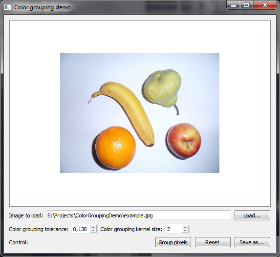
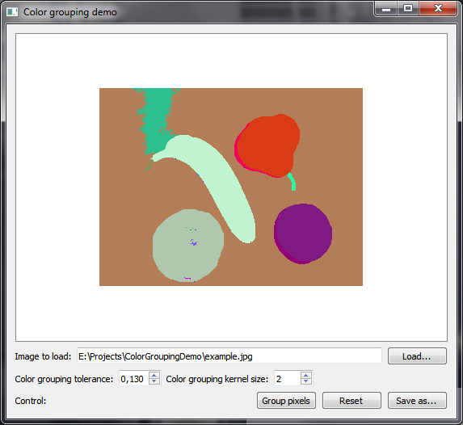

# ColorGroupingDemo
A program capable of grouping pixels by their colors. Written in Qt/C++.
## Download
Download link: [Win32 binary](https://github.com/Extender/ColorGroupingDemo/raw/master/bin/colorgroupingdemo-v1.0-bin-win32.zip)
## Screenshots
### Input

### Output (grouped)

